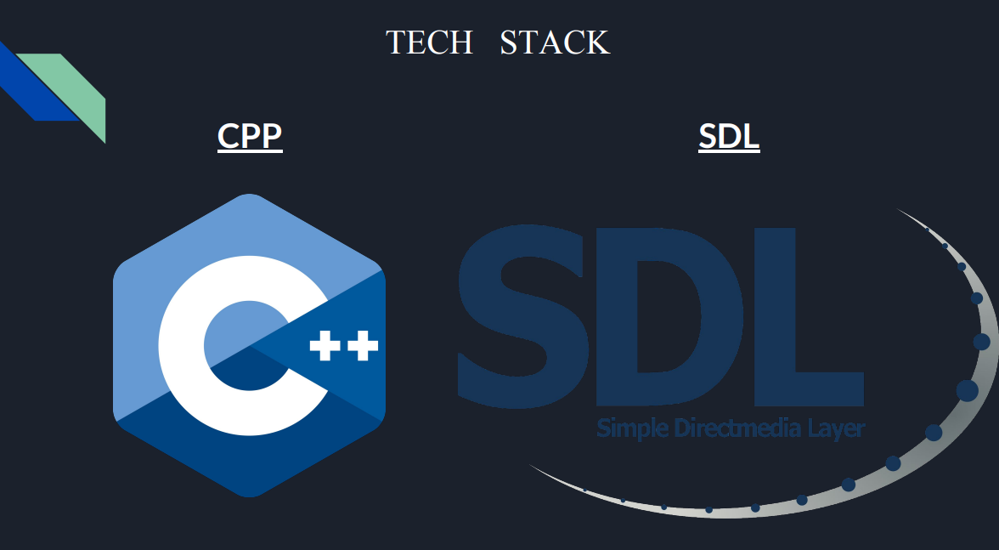

# Sorting Wizard - Unveiling Sorting Algorithms in Style 🚀

## Introduction

Welcome to Sorting Wizard, your gateway to the mesmerizing world of sorting algorithms, all brought to life with the elegance of C++ and the charm of SDL2. Dive into an immersive experience designed to educate and captivate enthusiasts of all levels.

## Project Demo:

## Technological Marvels & Project Set-ups:

- **MicroSoft Visual Studio**

- **C++ Brilliance:** Embark on a journey through sorting algorithms powered by the brilliance of C++, meticulously crafted to unveil the magic of algorithms.

- **SDL2 Wizardry:** Delve into a realm where sorting algorithms come alive with the wizardry of SDL2, seamlessly blending graphics and functionality for a captivating experience. The project begins with setting up the SDL2 library to handle graphical rendering and user interface elements.

## Features Galore

- **Algorithmic Symphony:** Explore a repertoire of sorting algorithms, from the classic Selection Sort to the agile Quick Sort, each choreographed to perfection.
- **Real-time Wonder:** Witness the magic unfold in real-time as algorithms dance across the screen, exchanging elements with grace and precision.
- **Intuitive Interaction:** Navigate effortlessly through Sorting Wizard with intuitive controls, seamlessly switching algorithms and randomizing datasets at your fingertips.
- **Data Delight:** Generate randomized datasets effortlessly or import predefined datasets from external files, primed for exploration.
- **Overcoming Challenges:** Overcome hurdles seamlessly with optimized performance, ensuring a smooth experience even with large datasets.

## Boundless Possibilities

- **Customization Extravaganza:** Unleash your creativity with customizable parameters, peeling back the layers of algorithmic behavior.
- **Comparison Chronicles:** Compare and contrast sorting algorithms with ease, paving the way for insightful analysis and discovery.
- **Educational Odyssey:** Immerse yourself in an interactive learning module, unraveling the mysteries of sorting algorithms with clarity and precision.

## Future Horizons

Elevate your understanding of sorting algorithms with Sorting Wizard — a fusion of innovation, education, and boundless possibilities.

